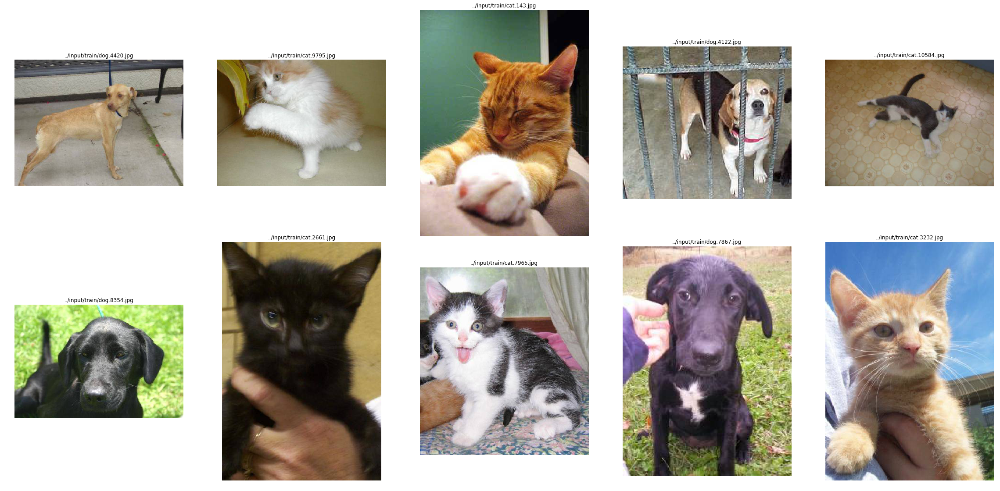
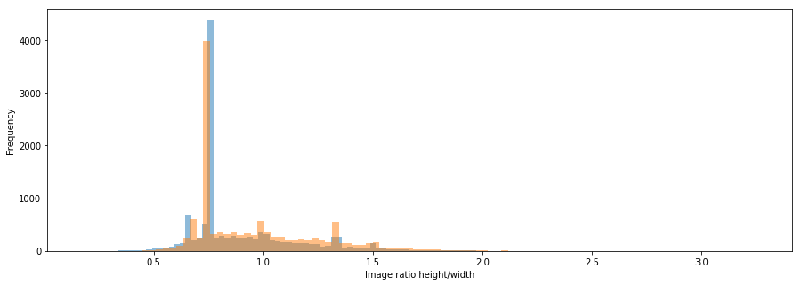
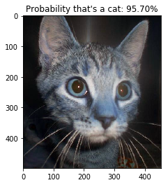
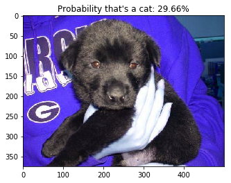
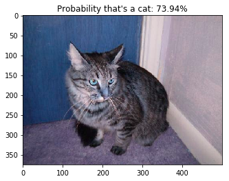

# Kaggle Projects 

# Table of Contents
1. [Cats and Dogs](#Cats and Dogs)

--------------
## Cats and Dogs
Implementation a Binary Classifier to recognize pets (cats or dogs) in an image.
Check out my kernel [here](https://www.kaggle.com/jmlbeaujour/cats-dogs-trimmed-vgg16-with-dilated-convolution)
The model is a trimmed version of VGG16 with 1 dilated convolution layer and a single FC layer that uses *swish* activation function. 

Trainable params: 360,865

<table style="border=0px solid #000"><tr><td>

</td>
</tr>
</table>

Distribution of Image Height-to-Width Ratio for cats and dogs class
<table style="border=0px solid #000"><tr><td>

</td></tr>
</table>

* Training:
After 8 Epochs ==> **loss: 0.2833 - acc: 0.8794 - val_loss: 0.4017 - val_acc: 0.8215**

* Prediction

<table style="border=0px solid #000"><tr><td>

</td><td>

</td>
<td>

</td>
</tr>
</table>

---

*Contact:*
Let me know if you have questions/suggestions. Feel free to connect with me on [LinkedIn](https://www.linkedin.com/in/jmlbeaujour/).